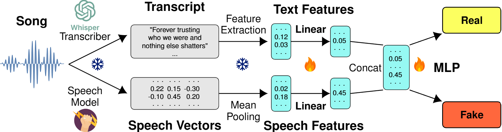

# Double Entendre

**Robust audio-based AI-generated lyrics detection via multi-view fusion.**

Code to reproduce the experiments presented in *"Double Entendre: Robust Audio-Based AI-Generated Lyrics Detection via Multi-View Fusion"* (Findings of ACL 2025) and *"AI-Generated Song Detection via Lyrics Transcripts"* (ISMIR 2025).

This repository provides tools for detecting AI-generated music by analyzing sung lyrics extracted via speech transcription. It supports multiple transcribers, feature extractors (text and audio), and evaluation scenarios including audio perturbations and out-of-distribution generalization.

## Overview

<p align="center">
  
</p>

**Supported scenarios:**
- Real vs. Fake (AI-generated lyrics + AI vocals)
- Real vs. Half-fake (human lyrics + AI vocals)
- Cross-platform generalization (Suno → Udio)
- Robustness under audio attacks (reverb, pitch, EQ, noise, time stretch)

---

## Project Structure

```
.
├── transcription/       # Audio → text transcription
│   ├── run_whisper.py   # Whisper transcription
│   ├── run_meta.py      # Meta models (Seamless, MMS)
│   └── ...
├── features/            # Feature extraction & detection
│   ├── feature_extractor.py  # Base class
│   ├── sbert.py, llm2vec.py  # Text features
│   ├── xeus.py, w2v2.py      # Speech features
│   ├── run_features.py       # Main experiments
│   └── ...
├── pyproject.toml
└── README.md
```

See module READMEs for details:
- [`transcription/README.md`](transcription/README.md)
- [`features/README.md`](features/README.md)

---

## Installation

```bash
git clone https://github.com/deezer/robust-AI-lyrics-detection.git
cd robust-AI-lyrics-detection
pip install .
```

**Requirements:** Python 3.9–3.11, CUDA-capable GPU recommended.

### Optional Dependencies

```bash
pip install ".[meta]"       # Meta speech models (Seamless, MMS)
pip install ".[demucs]"     # Source separation (improves transcription)
pip install ".[xeus]"       # XEUS speech features (requires checkpoint below)
pip install ".[binoculars]" # Binoculars detector
```

### XEUS Checkpoint

XEUS requires a manual checkpoint download:

```bash
wget https://huggingface.co/espnet/xeus/resolve/main/model/xeus_checkpoint.pth -P checkpoints/
```

---

## Quick Start

### 1. Transcribe

```bash
cd transcription
python run_whisper.py --model large-v2 --file_path data/real/songs.json
```

### 2. Detect

```bash
cd features
python run_features.py
```

---

## Data Format

Dataset JSON files should follow this structure:

```json
{
  "train": [
    {
      "md5": "abc123...",
      "text": "Original lyrics text...",
      "language_str": "en",
      "genre": "pop",
      "artist_name": "Artist",
      "class": "real"
    }
  ],
  "test": [...]
}
```

For AI-generated songs, include `mp3_url` or local `audio_path` instead of `md5`.

| Field | Description |
|-------|-------------|
| `md5` | Audio file hash (for path lookup) |
| `text` | Ground-truth lyrics |
| `language_str` | ISO language code |
| `class` | `real`, `generated`, or `half-fake` |
| `transcription` | Added by transcription scripts |

---

## Configuration

Environment variables for path configuration:

```bash
export AUDIO_BASE_PATH=/path/to/audio      # Audio file storage
export PROJECT_BASE_DIR=/path/to/project   # Project root
export ARTEFACTS_DIR=./artefacts           # Model outputs
```

---

## Citation

If you use this code, please cite:

### Double Entendre (Findings of ACL 2025)

```bibtex
@inproceedings{frohmann2025double,
    author    = {Frohmann, Markus and Meseguer-Brocal, Gabriel and 
                 Epure, Elena V. and Labrak, Yanis},
    title     = {{Double Entendre}: Robust Audio-Based {AI}-Generated Lyrics 
                 Detection via Multi-View Fusion},
    booktitle = {Findings of the Association for Computational Linguistics: ACL 2025},
    year      = {2025},
    publisher = {Association for Computational Linguistics}
}
```

### AI-Generated Song Detection via Lyrics Transcripts (ISMIR 2025)

```bibtex
@inproceedings{frohmann2025ai,
    author    = {Frohmann, Markus and Epure, Elena and 
                 Meseguer Brocal, Gabriel and Schedl, Markus and Hennequin, Romain},
    title     = {{AI}-Generated Song Detection via Lyrics Transcripts},
    booktitle = {Proceedings of the 26th International Society for 
                 Music Information Retrieval Conference (ISMIR)},
    year      = {2025},
    pages     = {121--130},
    address   = {Daejeon, South Korea},
    doi       = {10.5281/zenodo.17706345}
}
```

---

## Related Work

- [synthetic_lyrics_detection](https://github.com/deezer/synthetic_lyrics_detection) — Synthetic lyrics generation pipeline (TrustNLP 2025)

---

## License

MIT License. See [LICENSE](LICENSE).

Built at [Deezer Research](https://research.deezer.com/), Paris.
